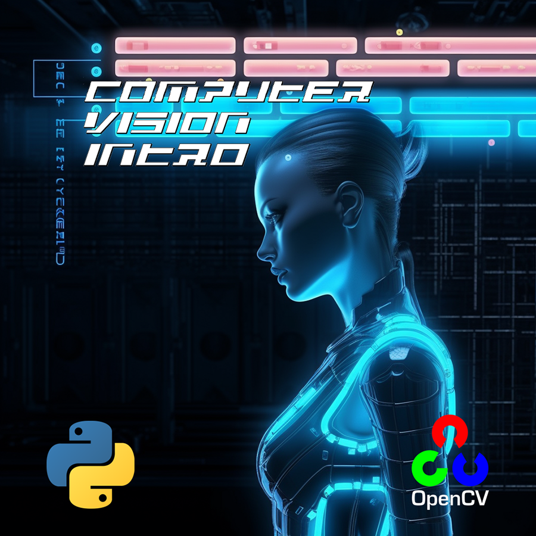

# Computer Vision Intro

This project was the challenge for Computer Vision Introduction class, concluded on the second year of my course.
Basically we used the code of one of the thousands of versions fo the original Atari game called Breakout and introduced a several tools from OpenCV to control the gamepad.

All of the tests were made in Pycharm IDE.

We tried three different controls using three diferent tools.

## Instalation

Clone the repository.
Run it on Pycharm.

### Structure

Computer_Vision_Practice/\
├── Code/\
ivc.png\
EDJD_IVC_2223_TPI_17010_23155.pdf\
EDJD_IVC_2223_TP2_17010_23155.pdf\
EDJD_IVC_2223_TP3_17010_23155.pdf

## Contributions
Any contibution is always welcome.

## Makers
- Ademar Valente
- Ruben Faria

## License
All rights reserved.
